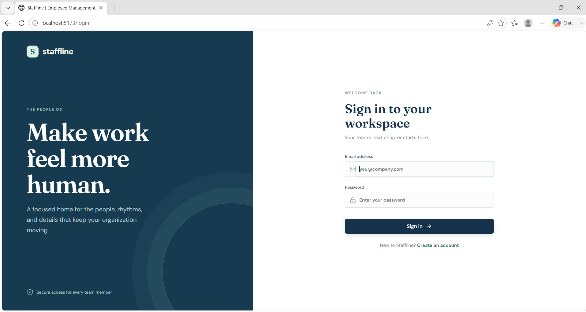
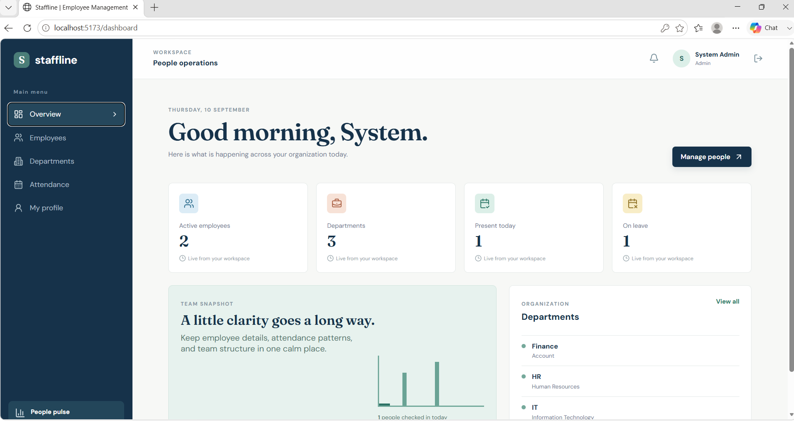
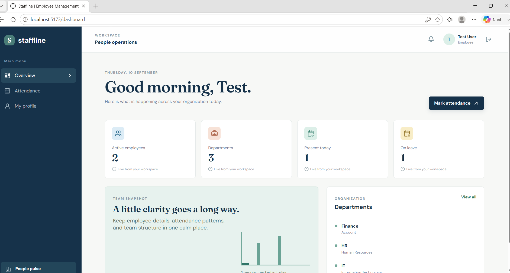

# Staffline - Employee Management System

A production-minded, role-based Employee Management System built with **React, Vite, Node.js, Express.js, MongoDB, Mongoose, JWT, and bcryptjs**.

Staffline provides separate workspaces for **Administrators and Employees**, with secure authentication, employee management, department management, attendance tracking, dashboards, and profile management.

## 🚀 Live Demo

👉 **[Open Staffline Application](https://employee-management-frontend-vxol.onrender.com)**

### Deployment

* **Frontend:** [employee-management-frontend-vxol.onrender.com](https://employee-management-frontend-vxol.onrender.com)
* **Backend API:** [employee-management-system-lr35.onrender.com](https://employee-management-system-lr35.onrender.com)
* **Database:** MongoDB Atlas
* **Hosting:** Render

> The backend root URL may return `404` because the API is designed around `/api/...` endpoints. This is expected.

---

## ✨ Features

### 🔐 Authentication & Authorization

* User registration and login
* JWT-based authentication
* Secure password hashing using bcryptjs
* Role-based authorization
* Separate Admin and Employee access
* Protected frontend routes
* Protected backend API routes
* Automatic token handling through Axios

### 👨‍💼 Employee Management

Administrators can:

* Create employees
* View employees
* Update employee information
* Delete employees
* Search employees
* Filter employees
* Paginate employee records
* View detailed employee profiles
* Assign employees to departments

### 🏢 Department Management

Administrators can:

* Create departments
* Update departments
* Delete departments
* View departments
* Assign department managers
* View department information

### 🕐 Attendance Management

Employees can:

* Mark daily attendance
* View their attendance history
* Track attendance status

Administrators can:

* View employee attendance
* Review attendance records
* Update attendance records

The system also prevents duplicate attendance entries for the same employee and date.

### 📊 Dashboard

The dashboard provides organization statistics including:

* Active employees
* Departments
* Today's attendance
* Employees on leave
* Employee-specific information

### 👤 Profile

Users can:

* View their profile
* Access personal account information
* View relevant employee information

### 📱 Responsive UI

The application is designed to work across:

* Desktop
* Laptop
* Tablet
* Mobile devices

---

## 🛠️ Technology Stack

### Frontend

* React.js
* Vite
* JavaScript
* React Router
* Axios
* HTML5
* CSS3

### Backend

* Node.js
* Express.js
* JavaScript
* Mongoose
* MongoDB
* JWT
* bcryptjs
* Express Validator
* Helmet
* CORS
* Morgan

### Database

* MongoDB
* MongoDB Atlas

### Development & Deployment

* Git
* GitHub
* Render
* Postman
* VS Code

---

## 🏗️ Architecture

```text
employee-management-system/
│
├── backend/
│   ├── config/
│   │   └── db.js
│   │
│   ├── controllers/
│   │
│   ├── middleware/
│   │   ├── auth.js
│   │   └── errorHandler.js
│   │
│   ├── models/
│   │   ├── User.js
│   │   ├── Employee.js
│   │   ├── Department.js
│   │   └── Attendance.js
│   │
│   ├── routes/
│   │   ├── auth.js
│   │   ├── employees.js
│   │   ├── departments.js
│   │   └── attendance.js
│   │
│   ├── server.js
│   ├── package.json
│   └── .env.example
│
├── frontend/
│   ├── src/
│   │   ├── components/
│   │   ├── context/
│   │   ├── pages/
│   │   ├── services/
│   │   ├── App.jsx
│   │   └── main.jsx
│   │
│   ├── package.json
│   └── .env.example
│
├── .gitignore
├── package.json
└── README.md
```

---

## 🔑 Role-Based Access

| Feature           | Employee | Admin |
| ----------------- | -------: | ----: |
| Dashboard         |        ✅ |     ✅ |
| Attendance        |        ✅ |     ✅ |
| Profile           |        ✅ |     ✅ |
| View Employees    |        ❌ |     ✅ |
| Create Employee   |        ❌ |     ✅ |
| Update Employee   |        ❌ |     ✅ |
| Delete Employee   |        ❌ |     ✅ |
| View Departments  |        ❌ |     ✅ |
| Create Department |        ❌ |     ✅ |
| Update Department |        ❌ |     ✅ |
| Delete Department |        ❌ |     ✅ |
| Review Attendance |        ❌ |     ✅ |

---

## ⚙️ Installation

### Prerequisites

Make sure the following are installed:

* Node.js 18+
* npm
* MongoDB or MongoDB Atlas
* Git

### 1. Clone the repository

```bash
git clone https://github.com/vivek65666/employee-management-system.git
```

```bash
cd employee-management-system
```

### 2. Install dependencies

Install root dependencies:

```bash
npm install
```

Install backend dependencies:

```bash
npm install --prefix backend
```

Install frontend dependencies:

```bash
npm install --prefix frontend
```

---

## 🔐 Environment Variables

### Backend

Create:

```text
backend/.env
```

Example:

```env
PORT=5000
MONGO_URI=mongodb://127.0.0.1:27017/employee_management
JWT_SECRET=replace_with_a_long_random_secret
JWT_EXPIRES_IN=1d
CLIENT_URL=http://localhost:5173
```

For production, use your **MongoDB Atlas connection string** instead of the local MongoDB URI.

> Never commit `.env` files or database passwords to GitHub.

### Frontend

Create:

```text
frontend/.env
```

Example:

```env
VITE_API_URL=http://localhost:5000/api
```

For the deployed application, the frontend uses the deployed backend API URL.

---

## ▶️ Running the Application Locally

### Start Backend

```bash
npm run dev --prefix backend
```

Backend:

```text
http://localhost:5000
```

### Start Frontend

Open another terminal:

```bash
npm run dev --prefix frontend
```

Frontend:

```text
http://localhost:5173
```

### Run both

From the project root:

```bash
npm run dev
```

---

## 🔌 API Endpoints

### Authentication

| Method | Endpoint             | Access        | Description      |
| ------ | -------------------- | ------------- | ---------------- |
| POST   | `/api/auth/register` | Public        | Register a user  |
| POST   | `/api/auth/login`    | Public        | Login            |
| GET    | `/api/auth/me`       | Authenticated | Get current user |

### Employees

| Method | Endpoint                   | Access        | Description          |
| ------ | -------------------------- | ------------- | -------------------- |
| GET    | `/api/employees`           | Admin         | Get employees        |
| GET    | `/api/employees/:id`       | Authenticated | Get employee details |
| POST   | `/api/employees`           | Admin         | Create employee      |
| PUT    | `/api/employees/:id`       | Admin         | Update employee      |
| DELETE | `/api/employees/:id`       | Admin         | Delete employee      |
| GET    | `/api/employees/dashboard` | Authenticated | Dashboard statistics |

### Departments

| Method | Endpoint               | Access        | Description       |
| ------ | ---------------------- | ------------- | ----------------- |
| GET    | `/api/departments`     | Authenticated | List departments  |
| GET    | `/api/departments/:id` | Authenticated | Get department    |
| POST   | `/api/departments`     | Admin         | Create department |
| PUT    | `/api/departments/:id` | Admin         | Update department |
| DELETE | `/api/departments/:id` | Admin         | Delete department |

### Attendance

| Method | Endpoint              | Access        | Description            |
| ------ | --------------------- | ------------- | ---------------------- |
| GET    | `/api/attendance`     | Authenticated | Get attendance records |
| GET    | `/api/attendance/:id` | Authenticated | Get attendance record  |
| POST   | `/api/attendance`     | Authenticated | Mark attendance        |
| PUT    | `/api/attendance/:id` | Admin         | Update attendance      |

Authenticated API requests use:

```text
Authorization: Bearer <JWT>
```

---

## 🧪 API Testing with Postman

### Register Admin

```http
POST /api/auth/register
```

Example request:

```json
{
  "name": "System Admin",
  "email": "admin@example.com",
  "password": "password123",
  "role": "admin"
}
```

### Login

```http
POST /api/auth/login
```

```json
{
  "email": "admin@example.com",
  "password": "password123"
}
```

The API returns a JWT token.

Use the token for protected requests:

```text
Authorization: Bearer <JWT>
```

### Create Department

```http
POST /api/departments
```

```json
{
  "name": "Engineering",
  "description": "Software development and engineering"
}
```

### Create Employee

```http
POST /api/employees
```

```json
{
  "employeeId": "EMP-001",
  "name": "Test Employee",
  "email": "employee@example.com",
  "phone": "+91 9876543210",
  "position": "Software Engineer",
  "salary": 50000,
  "joiningDate": "2026-09-01",
  "password": "password123"
}
```

### Mark Attendance

```http
POST /api/attendance
```

Example:

```json
{
  "date": "2026-09-10",
  "status": "Present",
  "checkIn": "09:00"
}
```

For employee users, the backend derives the employee from the authenticated account.

---

## 🔒 Security

The application implements several security practices:

* JWT authentication
* bcrypt password hashing
* Role-based authorization
* Protected API endpoints
* Protected React routes
* Helmet security middleware
* CORS configuration
* Environment-based configuration
* Request validation
* Centralized error handling
* Duplicate attendance prevention

---

## ☁️ Deployment

The application is deployed using **Render**.

### Frontend

```text
https://employee-management-frontend-vxol.onrender.com
```

### Backend

```text
https://employee-management-system-lr35.onrender.com
```

### Database

MongoDB Atlas is used as the production database.

### Deployment Architecture

```text
                    ┌─────────────────────┐
                    │      User / Browser │
                    └──────────┬──────────┘
                               │
                               ▼
                    ┌─────────────────────┐
                    │   React + Vite      │
                    │   Render Frontend    │
                    └──────────┬──────────┘
                               │
                         REST API / JWT
                               │
                               ▼
                    ┌─────────────────────┐
                    │ Node.js + Express   │
                    │   Render Backend    │
                    └──────────┬──────────┘
                               │
                          Mongoose
                               │
                               ▼
                    ┌─────────────────────┐
                    │   MongoDB Atlas     │
                    │    Production DB    │
                    └─────────────────────┘
```

---

## 📸 Screenshots

Screenshots can be added here to demonstrate the application UI.

Suggested screenshots:

* Login page
* Registration page
* Employee dashboard
* Admin dashboard
* Employee management
* Department management
* Attendance page
* Profile page

Example:

```markdown
## Screenshots

### Login



### Admin Dashboard



### Employee Dashboard



---

## 📂 Project Highlights

### Frontend

* Component-based React architecture
* React Router navigation
* Protected routes
* Role-based navigation
* Centralized Axios API client
* Authentication context
* Responsive UI
* Dashboard components

### Backend

* RESTful API architecture
* Express middleware
* MongoDB/Mongoose models
* JWT authentication
* Role-based authorization
* Input validation
* Centralized error handling
* Security middleware

---

## 🧠 Key Learning Outcomes

Through this project, I worked with:

* Full-stack web application development
* React frontend development
* REST API development
* Node.js and Express.js
* MongoDB and Mongoose
* JWT authentication
* Role-based authorization
* Password hashing
* API integration using Axios
* Git and GitHub
* MongoDB Atlas
* Cloud deployment using Render
* Environment variable configuration
* Production deployment and debugging

---

## 🔮 Future Improvements

Potential future enhancements include:

* Refresh-token rotation
* Email invitations
* Password reset functionality
* Audit logs
* CSV/Excel employee export
* Advanced attendance calendar
* Automated unit and integration tests
* CI/CD pipeline
* Docker deployment
* Notification system
* Employee leave management
* Advanced reporting and analytics

---

## 📄 License

This project is created for learning, portfolio, and demonstration purposes.

---

## 👨‍💻 Author

**Vivek C Raj**

* GitHub: [@vivek65666](https://github.com/vivek65666)
* LinkedIn: [linkedin.com/in/vivekcraj](https://linkedin.com/in/vivekcraj)

---

## ⭐ Project

If you find this project useful, consider giving the repository a ⭐ on GitHub.

**Live Application:**
👉 [Open Staffline](https://employee-management-frontend-vxol.onrender.com)

**Source Code:**
👉 [GitHub Repository](https://github.com/vivek65666/employee-management-system)
